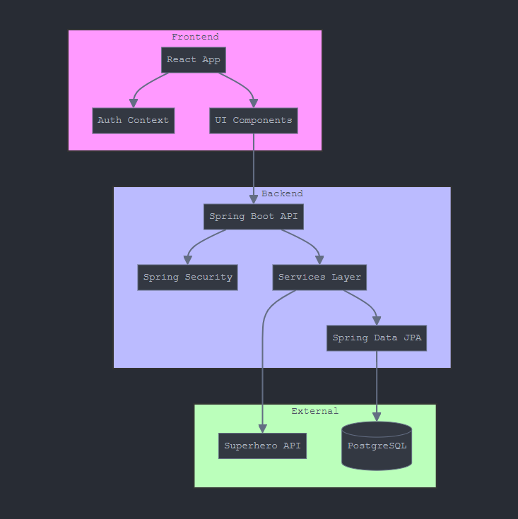
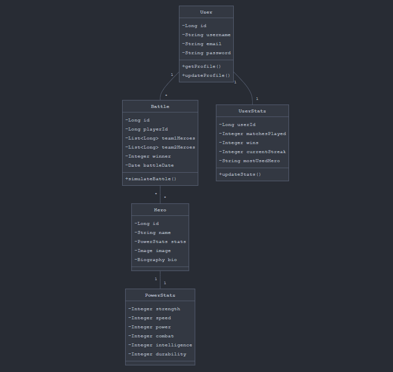
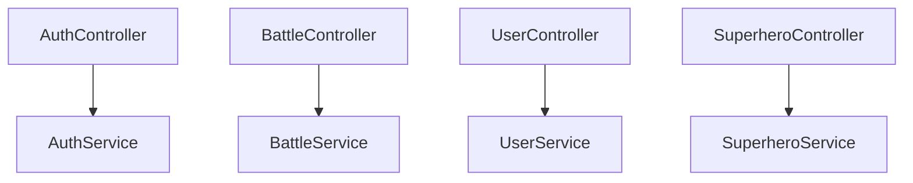

# System Architecture

## Project Structure Overview

The SuperHero Database application follows a layered architecture pattern with clear separation of concerns between components.

## Class Diagram

## Main Components

### Controllers Layer

### Service Layer
The service layer contains business logic and integrates with external APIs:
- AuthService: Handles user authentication
- BattleService: Manages battle mechanics
- UserService: User management
- SuperheroService: Superhero data management

### Repository Layer
Interfaces with the database using Spring Data JPA:
- UserRepository
- BattleRepository
- UserStatsRepository

[← Back to README](../README.md)
